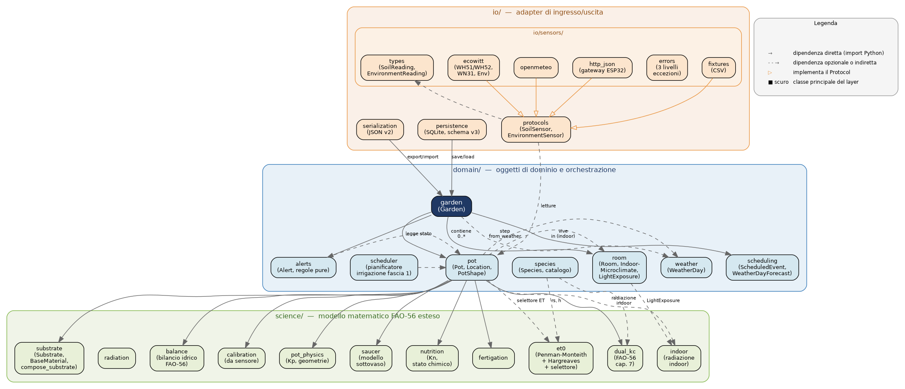
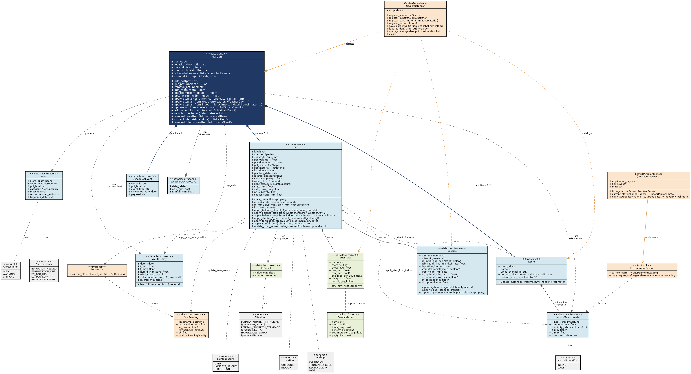

# fitosim

> Libreria Python per la simulazione FAO-56 del bilancio idrico e chimico
> dei vasi domestici. Il motore agronomico del dashboard "Il Mio Giardino".

fitosim è una libreria Python che ti aiuta a capire quanto e quando irrigare
le piante nei tuoi vasi. Funziona modellando il bilancio idrico e chimico del
singolo vaso giorno per giorno: quanta acqua entra (pioggia, irrigazione),
quanta esce (evapotraspirazione), quanta resta disponibile alla pianta, e
come evolve la concentrazione di sali e il pH del substrato. Estende lo
standard FAO-56 con sei capacità specifiche del giardinaggio in vaso che i
modelli per il pieno campo non coprono.

Sopra al modello del singolo vaso, fitosim costruisce un dashboard operativo
completo: il `Garden` orchestra più vasi insieme, la persistenza SQLite
conserva la storia, gli eventi pianificati e le previsioni a N giorni
anticipano gli interventi, e il sistema di allerte trasforma le previsioni in
raccomandazioni concrete per il giardiniere.

## Stato del progetto

- **865 test verdi** (più 1 skipped intenzionale, 340 sub-test)
- **Tempo esecuzione suite**: ~2.4 secondi su laptop standard
- **Linguaggio**: Python ≥ 3.10
- **Dipendenze esterne nel core**: zero (solo standard library)
- **Schema database**: SQLite v3 con migrazioni automatiche v1→v2→v3
- **Fascia 1**: completa (modello idrico FAO-56 esteso)
- **Fascia 2**: 4 tappe complete su 5 (80% del percorso)

```
$ python -m pytest tests/
============================= 865 passed, 1 skipped in 2.36s =============================
```

## Cosa fa

Il dominio in cui fitosim sa fare bene il suo lavoro è il **vaso domestico
singolo o un piccolo gruppo di vasi su un balcone**, su scala di tempo
giornaliera, per piante individualmente identificabili e con substrati di
parametri noti. In questo dominio specifico la libreria copre:

- Bilancio idrico FAO-56 standard con dual-Kc opzionale (capitolo 7 della
  pubblicazione FAO-56)
- Caratterizzazione fisica del vaso: materiale, colore, forma geometrica,
  esposizione solare (coefficiente di vaso Kp)
- Modello del sottovaso opzionale come componente di stato distinto, con
  riassorbimento capillare verso il substrato
- Sostrati personalizzati: catalogo di nove materiali base (akadama, pomice,
  perlite, ecc.) e factory `compose_substrate` per i mix
- Modello chimico completo: massa salina, pH, EC come grandezza derivata,
  coefficiente nutrizionale Kn che modula l'evapotraspirazione
- Esposizione differenziata alla pioggia per i vasi parzialmente coperti
- Calibrazione empirica dei parametri del substrato dalle letture storiche
  del sensore WH51
- Feedback loop sensore-modello in tempo reale con diagnostica strutturata
  della discrepanza
- **Garden**: orchestrazione di più vasi come unità coerente
- **Persistenza SQLite**: database operativo con storia completa degli stati
- **Serializzazione JSON**: formato di trasporto autocontenuto
- **Integrazione sensori in batch**: aggiornamento robusto a errori
  transitori
- **Eventi pianificati e forecast**: piani di fertirrigazione e proiezioni
  dello stato a N giorni
- **Sistema di allerte**: cinque categorie e tre severità, derivate dallo
  stato corrente o proiettato

## Cosa NON fa

È utile mettere subito in chiaro i confini del dominio, perché fitosim è uno
strumento specializzato e applicarlo fuori dal suo territorio produce
risultati poco affidabili.

fitosim non è un sostituto di modelli idrologici di pieno campo come HYDRUS
o RZWQM, che gestiscono bilanci a scala di parcella con flussi orizzontali
tra suoli adiacenti. Non è un sistema di controllo in tempo reale: le sue
stime sono giornaliere, non al minuto, e non è pensato per guidare
elettrovalvole con feedback continuo. Non è infine un sostituto del
giardiniere: ti dice "il vaso è sceso sotto la soglia di allerta", non
"irriga adesso 250 ml" senza che tu abbia la possibilità di valutare le
condizioni reali del momento.

## Quick start

### Hello basilico (singolo vaso)

L'esempio minimo per verificare che fitosim funzioni nel tuo ambiente. Crea
un vaso di basilico, simula un giorno di evapotraspirazione, e stampa lo
stato risultante.

```python
from datetime import date
from fitosim.domain.pot import Location, Pot
from fitosim.domain.species import BASIL
from fitosim.science.substrate import UNIVERSAL_POTTING_SOIL

vaso = Pot(
    label="Basilico balcone-1",
    species=BASIL,
    substrate=UNIVERSAL_POTTING_SOIL,
    pot_volume_l=2.0,
    pot_diameter_cm=18.0,
    location=Location.OUTDOOR,
    planting_date=date(2026, 4, 1),
)

print(f"Stato iniziale: {vaso.state_mm:.1f} mm")
print(f"Soglia di allerta: {vaso.alert_mm:.1f} mm")

vaso.apply_balance_step(
    et_0_mm=4.0, water_input_mm=0.0,
    current_date=date(2026, 4, 2),
)
print(f"Dopo un giorno di sole: {vaso.state_mm:.1f} mm")
```

### Hello balcone (Garden, sensori, allerte, persistenza)

L'esempio "completo" che mostra le capacità della tappa 4 in azione: tre
vasi orchestrati insieme, persistenza SQLite, eventi pianificati, allerte
sullo stato corrente e previste nei prossimi giorni.

```python
from datetime import date, datetime, timedelta, timezone
from fitosim.domain.garden import Garden
from fitosim.domain.pot import Location, Pot
from fitosim.domain.species import BASIL
from fitosim.domain.scheduling import ScheduledEvent, WeatherDayForecast
from fitosim.io.persistence import GardenPersistence
from fitosim.science.substrate import UNIVERSAL_POTTING_SOIL

# Costruisci il giardino con tre vasi a esposizioni diverse alla pioggia.
balcone = Garden(name="balcone-milano")
for label, exposure in [("aperto", 1.0),
                        ("ringhiera", 0.5),
                        ("albero", 0.2)]:
    balcone.add_pot(Pot(
        label=label, species=BASIL, substrate=UNIVERSAL_POTTING_SOIL,
        pot_volume_l=2.0, pot_diameter_cm=18.0,
        location=Location.OUTDOOR,
        planting_date=date(2026, 5, 1),
        rainfall_exposure=exposure,
    ))

# Persisti il giardino in un database SQLite locale.
db = GardenPersistence("/tmp/giardino.db")
db.register_species(BASIL)
db.register_substrate(UNIVERSAL_POTTING_SOIL)
db.save_garden(balcone, snapshot_timestamp=datetime.now(timezone.utc))

# Pianifica una fertirrigazione per il prossimo lunedì.
balcone.add_scheduled_event(ScheduledEvent(
    event_id="fert-aperto-w1",
    pot_label="aperto",
    event_type="fertigation",
    scheduled_date=date(2026, 5, 25),
    payload={"volume_l": 0.3, "ec_mscm": 2.0, "ph": 6.2},
))

# Applica un giorno di simulazione a tutti i vasi insieme.
balcone.apply_step_all(
    et_0_mm=4.5, current_date=date(2026, 5, 20),
    rainfall_mm=0.0,
)

# Allerte sullo stato corrente.
for alert in balcone.current_alerts(date(2026, 5, 20)):
    print(f"[{alert.severity.value}] {alert.pot_label}: {alert.message}")

# Previsione e allerte previste per i prossimi 7 giorni.
forecast_meteo = [
    WeatherDayForecast(
        date_=date(2026, 5, 20) + timedelta(days=i),
        et_0_mm=5.0, rainfall_mm=0.0,
    )
    for i in range(7)
]
risultato = balcone.forecast(forecast_meteo)
for alert in balcone.forecast_alerts(forecast_meteo):
    print(f"Tra {(alert.triggered_date - date(2026, 5, 20)).days} giorni: "
          f"{alert.pot_label} - {alert.category.value}")
```

Se il primo esempio gira e stampa tre numeri sensati, fitosim è installato
correttamente. Se il secondo esempio gira e produce le allerte, hai a
disposizione tutto il dashboard operativo della tappa 4.

## Installazione

fitosim richiede **Python ≥ 3.10**. Non ha dipendenze esterne nel core: tutto
il codice agronomico, dalla matematica FAO-56 alla persistenza SQLite, gira
con la sola standard library di Python. È pensato per girare bene anche su
ambienti vincolati come Termux su Android o Raspberry Pi 5.

Per ora fitosim è distribuito come repository sorgente, non è ancora
pubblicato su PyPI:

```bash
git clone https://github.com/<tuo-username>/fitosim.git
cd fitosim
python -m pytest tests/  # verifica che la suite gira (865 verdi attesi)
```

Per usare la libreria nei tuoi script puoi scegliere tra due opzioni. La
prima è impostare `PYTHONPATH=src` quando lanci gli script:

```bash
PYTHONPATH=src python tuo_script.py
```

La seconda è installare in modalità sviluppo:

```bash
pip install -e .
python tuo_script.py
```

L'opzione consigliata per uso prolungato è la seconda perché crea un link
simbolico nel virtual environment e rende fitosim importabile da qualsiasi
script.

## Architettura

La libreria è organizzata in tre layer architetturali con dipendenze che
vanno solo "verso il basso": `domain` dipende da `science` (mai il
contrario), `io` dipende da `domain` (mai il contrario). Questo principio
protegge il modello scientifico dai dettagli applicativi: puoi cambiare il
database da SQLite a PostgreSQL senza toccare nulla del modello FAO-56.



Il layer `science/` contiene il modello matematico FAO-56 esteso: bilancio
idrico, calcolo ET₀, dual-Kc, fisica del vaso (Kp), modello chimico
(coefficiente Kn), sottovaso, fertirrigazione, calibrazione empirica. Sono
prevalentemente funzioni pure più qualche dataclass (`Substrate`,
`BaseMaterial`).

Il layer `domain/` contiene gli oggetti di dominio e l'orchestrazione: `Pot`
è la classe centrale che monta insieme tutte le componenti scientifiche in
un'entità coerente, `Garden` orchestra più vasi insieme, `Species` e
`Substrate` caratterizzano la pianta e il terriccio, `Alert`,
`ScheduledEvent` e `WeatherDayForecast` sono le strutture introdotte dalla
tappa 4.

Il layer `io/` contiene gli adapter di ingresso e uscita: `persistence`
(SQLite) e `serialization` (JSON) sono completamente disaccoppiati tra loro;
sotto `io/sensors/` vivono cinque adapter concreti (Ecowitt, Open-Meteo,
HTTP-JSON, fixtures CSV) che implementano lo stesso `Protocol` definito in
`protocols.py`.

### Le entità di dominio

Il diagramma delle classi qui sotto mostra le entità principali con le loro
relazioni. Il `Pot` è la scatola più grande perché concentra tutto il sapere
agronomico della libreria; il `Garden` è il punto di sutura tra modello
scientifico e applicazione operativa.



Una proprietà strutturale che il diagramma mette in luce è il pattern
"stato canonico minimo + viste derivate": il `Pot` ha solo quattro veri
attributi di stato dinamico (`state_mm`, `salt_mass_meq`, `ph_substrate`,
`saucer_state_mm`), e tutte le altre quantità (`state_theta`,
`ec_substrate_mscm`, `fc_mm`, `pwp_mm`, `alert_mm`, `kp`) sono property
calcolate on-demand. Conseguenza pratica: il database memorizza solo quei
quattro numeri per ogni snapshot, e tutto il resto viene ricalcolato al
caricamento.

## Repository

```
fitosim/
├── src/fitosim/
│   ├── domain/             # entità di dominio e orchestrazione
│   │   ├── garden.py       # Garden orchestratore (tappa 4)
│   │   ├── pot.py          # Pot, classe centrale del modello
│   │   ├── species.py      # Species, catalogo specie predefinite
│   │   ├── alerts.py       # Sistema di allerte (tappa 4)
│   │   ├── scheduling.py   # ScheduledEvent, WeatherDayForecast
│   │   └── scheduler.py    # Pianificatore irrigazione (fascia 1)
│   ├── science/            # modello matematico FAO-56 esteso
│   │   ├── substrate.py    # Substrate, BaseMaterial, mix
│   │   ├── balance.py      # bilancio idrico FAO-56
│   │   ├── et0.py          # calcolo ET₀
│   │   ├── dual_kc.py      # FAO-56 capitolo 7
│   │   ├── pot_physics.py  # Kp, geometrie del vaso
│   │   ├── saucer.py       # modello sottovaso
│   │   ├── nutrition.py    # coefficiente Kn (tappa 3)
│   │   ├── fertigation.py  # applicazione fertirrigazione
│   │   ├── calibration.py  # calibrazione da sensore
│   │   └── radiation.py    # radiazione solare
│   └── io/                 # adapter di acquisizione e persistenza
│       ├── persistence.py  # SQLite, schema v3 (tappa 4)
│       ├── serialization.py # JSON formato v2 (tappa 4)
│       └── sensors/
│           ├── protocols.py    # SoilSensor, EnvironmentSensor (Protocol)
│           ├── types.py        # SoilReading, EnvironmentReading
│           ├── errors.py       # gerarchia eccezioni a 3 livelli
│           ├── ecowitt.py      # adapter WH51 via Ecowitt Cloud
│           ├── openmeteo.py    # adapter Open-Meteo (meteo)
│           ├── http_json.py    # adapter generico per gateway ESP32
│           └── fixtures.py     # adapter CSV per test
├── tests/                  # 865 test verdi
├── examples/               # esempi e demo end-to-end
│   ├── tappa4_complete_demo.py
│   └── README-tappa4-demo.md
├── docs/
│   ├── fitosim_user_manual.docx     # manuale utente, 17 capitoli
│   ├── fitosim_status_report.docx   # report di status del progetto
│   └── uml/
│       ├── fitosim_packages.dot     # sorgente diagramma package
│       ├── fitosim_packages.png
│       ├── fitosim_classes.dot      # sorgente diagramma classi
│       └── fitosim_classes.png
└── README.md
```

## Storia delle tappe

Il progetto è strutturato in due fasce di lavoro, ognuna composta da più
tappe. La fascia 1 ha costruito il modello idrico completo del singolo vaso;
la fascia 2 sta estendendo la libreria con sensoristica reale, modello
chimico, e architettura applicativa.

### Fascia 1 — Modello idrico completo (chiusa)

Sei tappe completate che hanno introdotto: caratterizzazione fisica del vaso
(forma, materiale, esposizione), sottovaso opzionale, sostrati
personalizzati con factory `compose_substrate`, dual-Kc di FAO-56 capitolo
7, calibrazione empirica del substrato, feedback loop sensore-modello. La
fascia conta 423 test verdi che continuano a passare al byte ad ogni nuova
consegna della fascia 2.

### Fascia 2 — Sensori, chimica, architettura applicativa (4/5 tappe)

**Tappa 1 — Astrazione sensori (completa).** Ha costruito l'astrazione di
sensore di fitosim come `Protocol` Python, separando il modello scientifico
dai dettagli di acquisizione. Tipi di ritorno strutturati
(`EnvironmentReading`, `SoilReading`) con timestamp UTC obbligatorio,
gerarchia di eccezioni canoniche a tre livelli
(`SensorTemporaryError`/`SensorPermanentError`/`SensorDataQualityError`).

**Tappa 2 — Gateway hardware-to-HTTP (completa).** Ha aggiunto il primo
sensore di suolo "ricco" (θ, temperatura, EC, pH) tramite un pattern
generico: adapter `HttpJsonSoilSensor` che parla con un gateway esterno via
schema JSON V1. Il gateway si occupa dei dettagli hardware (Modbus RTU su
RS485 nel caso ATO) e li espone come endpoint REST. La consegna include un
firmware ESP32 di esempio in cinque file Arduino.

**Tappa 3 — Modello chimico del substrato (completa).** Ha esteso il `Pot`
col modello chimico completo: massa salina come stato canonico, pH come
stato indipendente, EC come property derivata. Coefficiente nutrizionale Kn
che modula l'evapotraspirazione in funzione dello stato chimico. Il
fenomeno della concentrazione per evapotraspirazione emerge automaticamente.
Coefficiente di esposizione alla pioggia (`rainfall_exposure`) per i vasi
parzialmente coperti.

**Tappa 4 — Dashboard operativo completo (completa).** La tappa più
sostanziosa per scope architetturale, organizzata in cinque sotto-tappe che
hanno aggiunto in totale 179 test verdi:

| Sotto-tappa | Capacità | Test |
|---|---|---|
| A: Garden in-memory | Orchestrazione di più vasi come unità coerente | +30 |
| B fase 1: SQLite | Persistenza con storia completa degli stati | +32 |
| B fase 2: JSON | Formato di trasporto per backup e migrazione | +20 |
| C: integrazione sensori | Update batch dai sensori reali con robustezza errori | +23 |
| D: forecast e eventi | Eventi pianificati e proiezione dello stato a N giorni | +36 |
| E: sistema di allerte | Allerte derivate dallo stato per dashboard proattivo | +38 |

**Tappa 5 — Penman-Monteith e indoor (da iniziare).** Chiuderà la fascia 2
con due raffinamenti complementari del modello scientifico: il modello
Penman-Monteith completo per il calcolo di ET₀ (più accurato della formula
di Hargreaves che la libreria usa attualmente per i casi di backup), e il
modello dei vasi indoor che dipendono dal microclima della stanza
(alimentato dal sensore WN31 CH1 di Ecowitt, specifico per le piante in
appartamento).

## Documentazione

La documentazione del progetto vive in `docs/` e copre tre livelli di
approfondimento.

**Manuale utente** (`docs/fitosim_user_manual.docx`): la guida completa di
17 capitoli più tre appendici, scritta in italiano con stile narrativo. È
il punto di riferimento per imparare a usare la libreria, dai concetti
fondamentali (capitoli 1-3) alle capacità avanzate del singolo vaso
(4-9), dal dashboard operativo del balcone (10-16) alle FAQ (17). Le
appendici contengono il catalogo delle specie pre-definite, i substrati
disponibili, e un glossario dei termini agronomici.

**Status report** (`docs/fitosim_status_report.docx`): il riassunto
quantitativo dello stato di sviluppo, con metriche, roadmap e storico delle
consegne. Aggiornato ad ogni chiusura di tappa.

**Demo end-to-end** (`examples/tappa4_complete_demo.py` con README di
accompagnamento): uno script Python eseguibile che mostra in azione tutte
le capacità della tappa 4 su uno scenario realistico di tre vasi di
basilico monitorati per 21 giorni, con output didattico tra blocchi di
giorni. Gira da solo in pochi secondi senza hardware reale.

**Diagrammi UML** (`docs/uml/`): due diagrammi (package e classi del
dominio) come sorgenti DOT versionati e PNG renderizzati. Si rigenerano
con `dot -Tpng <file>.dot -o <file>.png`.

## Licenza

fitosim è distribuito sotto **MIT License**. Vedi il file `LICENSE` per il
testo completo.

```
Copyright (c) 2026 Andrea Ceriani

Permission is hereby granted, free of charge, to any person obtaining a
copy of this software and associated documentation files (the "Software"),
to deal in the Software without restriction [...]
```

La licenza MIT è permissiva: chiunque può usare, modificare e ridistribuire
il software, anche per scopi commerciali, a condizione di mantenere il
copyright notice originale. Il software è fornito "as is" senza garanzie.

## Autore

Andrea Ceriani — fitosim nasce come progetto personale per modellare con
precisione il bilancio idrico e chimico dei vasi del mio balcone milanese,
con l'obiettivo di costruirci sopra il dashboard "Il Mio Giardino"
self-hosted su Raspberry Pi 5 o Android in Termux. Quando il sistema avrà
raccolto qualche mese di dati reali dai sensori del balcone, comincerà la
fascia 3 di calibrazione che trasformerà fitosim da "libreria genericamente
plausibile" a "libreria calibrata per il TUO balcone milanese".
