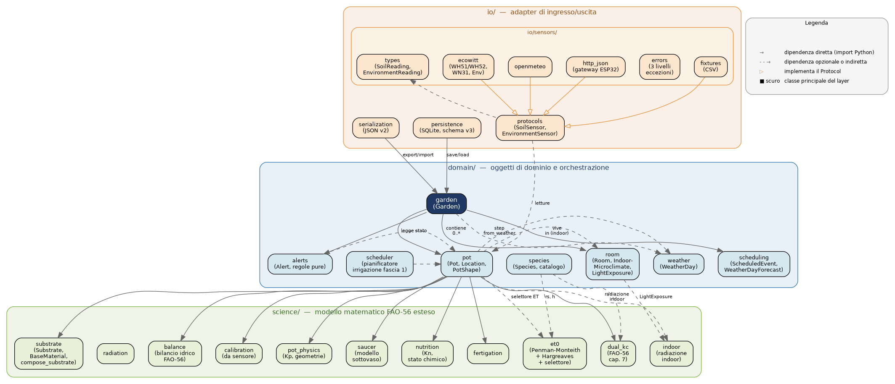
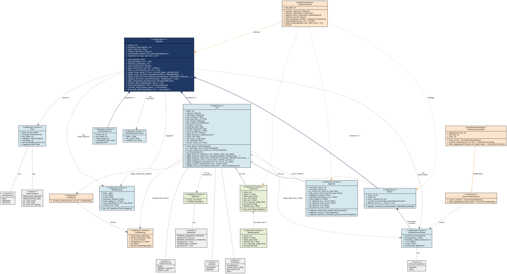

# fitosim

> Libreria Python per la simulazione FAO-56 del bilancio idrico e chimico
> dei vasi domestici. Il motore agronomico di The Pot.

fitosim è una libreria Python che ti aiuta a capire quanto e quando irrigare
le piante nei tuoi vasi. Funziona modellando il bilancio idrico e chimico del
singolo vaso giorno per giorno: quanta acqua entra (pioggia, irrigazione),
quanta esce (evapotraspirazione), quanta resta disponibile alla pianta, e
come evolve la concentrazione di sali e il pH del substrato. Estende lo
standard FAO-56 con capacità specifiche del giardinaggio in vaso che i
modelli per il pieno campo non coprono, dalle geometrie reali del vaso al
sottovaso, dalle miscele di substrati al modello chimico, dal bilancio
indoor con microclima della stanza al selettore "best available" del metodo
di evapotraspirazione.

fitosim è **il motore, non un'applicazione**. È nato per girare da solo — un
giardino di vasi, un database SQLite, i sensori letti in rete, un'agenda — e
dal settembre 2026 è il motore di **The Pot**, che ha il suo database, i suoi
sensori e il suo calendario. Lo strato che faceva quelle cose è stato tolto
il 25 novembre 2026 (versione 0.46.0): restano il modello del vaso, le
regole delle allerte e il client grezzo del cloud Ecowitt.

## Stato del progetto

- **Versione**: 0.46.0 (`pyproject.toml`, dal 2026-11-25: via lo strato standalone — giardino, database, sensori, eventi —, resta il motore; 0.45.0 il 24-11, via gli esempi e il JSON, la libreria e i suoi test con la sola standard library; 0.44.0 lo stesso giorno, la luce misurata al vaso entra nel passo in casa, con la conversione dal lux; 0.43.0 lo stesso giorno, in casa a Penman-Monteith va la radiazione netta e la luce si conta una volta; 0.42.0 lo stesso giorno, gli strumenti — ruff, mypy e una CI —, Python 3.12 come minimo; 0.41.0 lo stesso giorno, la luce utile alla pianta, `science/light.py`, e il fattore di luce sull'assorbimento dei nutrienti; 0.40.0 il 06-11, il limite inferiore ferma il flusso e non crea acqua, `BalanceStepResult.et_actual`; 0.39.0 lo stesso giorno, un limite solo per il Kc, 2.50; 0.38.0 il 05-11, quanto asciuga il materiale come numero del vaso, `Pot.material_factor`; 0.37.0 il 30-10, la foto della webcam HP10 nel tempo reale di Ecowitt; 0.36.0 il 25-10, le valvole IoT; 0.35.0 il 21-10, le pressioni di vapore dagli estremi del giorno, A9; 0.34.0 il 29-09, il giorno fatto di blocchi; 0.33.0 il 22-09, la sonda EC; 0.32.0 lo stesso giorno, i serbatoi nutritivi; 0.31.0 il 20-09; prima la serie `v0_NN` nei commit, fino a `v0_30`)
- **1150 test verdi** (520 sub-test), senza dipendenze esterne
- **Le pressioni di vapore dagli estremi del giorno** (A9, 2026-10-21): e_s ed e_a dagli estremi del giorno nel Penman-Monteith giornaliero: la media di e°(T_max) ed e°(T_min) (FAO-56 eq. 12) al posto di e°(T_media), che la sottostima, ed e_a dalle umidità estreme (eq. 17) quando la stazione le dà, dalla media (eq. 19) altrimenti; `WeatherDay` ha `humidity_min` e `humidity_max`; la forma oraria non cambia. Misurato sulle settimane dell'esempio delle stagioni, l'ET₀ giornaliera sale del 2–4 % e coincide con la FAO di riferimento al decimo di percento; in una stanza non cambia.
- **Il giorno fatto di blocchi** (A7, 2026-09-29): il vaso avanza a blocchi di ore dentro il giorno — `Pot.apply_blocks_from_weather`, `domain/blocks.py` con le nove decisioni e le fonti; il passo giornaliero è il caso di un blocco di 24 ore, con gli stessi numeri
- **Tempo esecuzione suite**: poco più di un secondo
- **Linguaggio**: Python ≥ 3.12
- **Dipendenze esterne nel core**: zero (solo standard library)
- **Fascia 1**: completa (modello idrico FAO-56 esteso)
- **Fascia 2**: completa (5 tappe: sensori, chimica, architettura, Penman-Monteith, indoor)
- **Fascia 3**: **in corso** — la fase A del *layer di feedback* (calibrazione multi-fonte) è in fitosim; il modello è stato rivisto numero per numero il 18–20 settembre 2026 (Kn, CEC e densità, `p`, pendenza salina, dormienza), ogni costante con la fonte o dichiarata stima; il 29 settembre il vaso ha imparato ad avanzare a blocchi di ore dentro il giorno (A7)
- **Prossimo passo**: la calibrazione sul sensore WH52, cinque vasi sul balcone dalla settimana del 28 settembre 2026 (`docs/calibrazione_con_WH5X.md`; lo strumento vive in The Pot)

```
$ python -m pytest tests/
================= 1150 passed, 520 subtests passed =================
```

## Cosa fa

Il dominio in cui fitosim sa fare bene il suo lavoro è il **vaso domestico
singolo o un piccolo gruppo di vasi su un balcone**, su scala di tempo
giornaliera, per piante individualmente identificabili e con substrati di
parametri noti. In questo dominio specifico la libreria copre:

- Bilancio idrico FAO-56 standard con dual-Kc opzionale (capitolo 7 della
  pubblicazione FAO-56)
- Caratterizzazione fisica del vaso: materiale, colore, forma geometrica,
  esposizione solare (coefficiente di vaso Kp)
- La pianta dentro il vaso: la copertura della chioma scala il coefficiente
  colturale (FAO-56 cap. 9, anche oltre la copertura piena) e l'altezza
  misurata entra in Penman-Monteith al posto di quella della specie
  (`docs/fitosim_canopy_design.md`)
- Modello del sottovaso opzionale come componente di stato distinto, con
  riassorbimento capillare verso il substrato
- La capacità di contenitore (`science/retention.py`, 21-10-2026, solo la
  matematica): la θ media di una colonna alta h a drenaggio finito dalla curva
  di ritenzione — van Genuchten, anche da due punti del catalogo note θ_s e la
  residua, o una curva per punti —, lo spazio d'aria e il profilo lungo la
  colonna (Milks, Fonteno & Larson 1989). Non entra ancora nel vaso: `Pot.fc_mm`
  resta θ_FC × profondità finché la differenza fra una cassetta da 13 cm e un
  vaso da 20 non è misurata con le pesate.
- Sostrati personalizzati: factory `compose_substrate` per i mix, con nove
  materiali base dimostrativi (akadama, pomice, perlite, ecc.); dal 21-10-2026
  (B5) deriva anche densità, pH e CEC del mix — le prime due sui volumi, la
  CEC sulla massa — con le formule che The Pot usava in due copie. **Il catalogo
  ufficiale di specie, substrati e componenti è quello di The Pot**
  (`the-pot/catalog/`, con le fonti): le specie e i substrati definiti qui
  sono fixture per test ed esempi, e la convenzione delle costanti idriche
  dell'app è quella dei substrati (θ_PWP a −10 kPa, vedi `Substrate`)
- Modello chimico completo: massa salina, pH, EC come grandezza derivata,
  coefficiente nutrizionale Kn che modula l'evapotraspirazione
- Esposizione differenziata alla pioggia per i vasi parzialmente coperti
- Calibrazione empirica dei parametri del substrato dalle letture storiche
  del sensore WH51
- Feedback loop sensore-modello in tempo reale con diagnostica strutturata
  della discrepanza
- **Layer di feedback (fascia 3, fase A)**: cinque fonti di calibrazione che
  propongono correzioni tracciabili senza mai toccare il catalogo globale —
  pendenza del sensore e lisimetro per il Kc, gradi-giorno per la fenologia,
  scostamento delle irrigazioni e giudizi sulle allerte per il comportamento
  — più una regola di precedenza che le compone quando più fonti toccano lo
  stesso parametro
- **Sistema di allerte**: cinque categorie e tre severità, regole pure sul
  singolo vaso, derivate dallo stato corrente
- **Selettore "best available" dell'evapotraspirazione**: Penman-Monteith
  fisico (con resistenza stomatica della specie), Penman-Monteith standard
  FAO-56 e Hargreaves-Samani come fallback, scelti automaticamente in
  funzione dei dati meteo disponibili e dei parametri della specie
- **Modello dei vasi indoor**: entità `Room` per gli spazi indoor con
  microclima condiviso, bilancio idrico alimentato dal microclima della
  stanza invece che dal meteo esterno, e la radiazione al vaso dal dato
  migliore che c'è — misurata, da una frazione misurata, o dal livello di
  luce (`LightExposure`)
- **La luce utile alla pianta**: il DLI al vaso, anche da un sensore in lux,
  e il suo effetto sull'assorbimento dei nutrienti (`science/light.py`)
- **Il client del cloud Ecowitt** (`io/ecowitt.py`): la stazione, le sonde
  WH51 e WH52 nel substrato, le valvole, la storia; grezzo, senza adapter

## Cosa NON fa

È utile mettere subito in chiaro i confini del dominio, perché fitosim è uno
strumento specializzato e applicarlo fuori dal suo territorio produce
risultati poco affidabili.

fitosim non è un sostituto di modelli idrologici di pieno campo come HYDRUS
o RZWQM, che gestiscono bilanci a scala di parcella con flussi orizzontali
tra suoli adiacenti. Non è un sistema di controllo in tempo reale: le sue
stime sono giornaliere, non al minuto, e non è pensato per guidare
elettrovalvole con feedback continuo. Non è infine un sostituto del
giardiniere: ti dice "il vaso è sceso sotto la soglia di allerta", non
"irriga adesso 250 ml" senza che tu abbia la possibilità di valutare le
condizioni reali del momento.

## Quick start

### Hello basilico (singolo vaso)

L'esempio minimo per verificare che fitosim funzioni nel tuo ambiente. Crea
un vaso di basilico, simula un giorno di evapotraspirazione, e stampa lo
stato risultante.

```python
from datetime import date
from fitosim.domain.pot import Location, Pot
from fitosim.domain.species import BASIL
from fitosim.science.substrate import UNIVERSAL_POTTING_SOIL

vaso = Pot(
    label="Basilico balcone-1",
    species=BASIL,
    substrate=UNIVERSAL_POTTING_SOIL,
    pot_volume_l=2.0,
    pot_diameter_cm=18.0,
    location=Location.OUTDOOR,
    planting_date=date(2026, 4, 1),
)

print(f"Stato iniziale: {vaso.state_mm:.1f} mm")
print(f"Soglia di allerta: {vaso.alert_mm:.1f} mm")

vaso.apply_balance_step(
    et_0_mm=4.0, water_input_mm=0.0,
    current_date=date(2026, 4, 2),
)
print(f"Dopo un giorno di sole: {vaso.state_mm:.1f} mm")
```

Se l'esempio gira e stampa tre numeri sensati, fitosim è installato
correttamente.

## Installazione

fitosim richiede **Python ≥ 3.12** (dal 24 novembre 2026, come The Pot). Non ha dipendenze esterne nel core: tutto
il codice agronomico gira
con la sola standard library di Python. È pensato per girare bene anche su
ambienti vincolati come Termux su Android o Raspberry Pi 5.

Per ora fitosim è distribuito come repository sorgente, non è ancora
pubblicato su PyPI:

```bash
git clone https://github.com/<tuo-username>/fitosim.git
cd fitosim
# Il core gira senza dipendenze esterne (1394 verdi attesi):
python -m pytest tests/ --ignore=tests/test_demo_appartamento.py
```

Per usare la libreria nei tuoi script puoi scegliere tra due opzioni. La
prima è impostare `PYTHONPATH=src` quando lanci gli script:

```bash
PYTHONPATH=src python tuo_script.py
```

La seconda è installare in modalità sviluppo:

```bash
pip install -e .
python tuo_script.py
```

L'opzione consigliata per uso prolungato è la seconda perché crea un link
simbolico nel virtual environment e rende fitosim importabile da qualsiasi
script.

Chi ci lavora ha tre cancelli, gli stessi che la CI passa a ogni push su
Python 3.12, 3.13 e 3.14 (`.github/workflows/ci.yml`):

```bash
uv sync --extra dev
uv run ruff check src tests   # le regole, le stesse di The Pot
uv run mypy                   # i tipi dei sorgenti
uv run pytest -q              # i test
```

## Architettura

La libreria è organizzata in tre layer architetturali con dipendenze che
vanno solo "verso il basso": `domain` dipende da `science` (mai il
contrario), `io` dipende da `domain` (mai il contrario). Questo principio
protegge il modello scientifico dai dettagli applicativi.



*I due diagrammi di questa sezione sono di prima del 25 novembre 2026:
mostrano ancora `Garden`, la persistenza e gli adapter dei sensori, che non
ci sono più. Sono da rigenerare dai sorgenti `.dot`.*

Il layer `science/` contiene il modello matematico FAO-56 esteso: bilancio
idrico, calcolo ET (Penman-Monteith fisico, Penman-Monteith standard FAO-56,
Hargreaves-Samani, e selettore "best available" che sceglie automaticamente
la formula migliore disponibile), dual-Kc, fisica del vaso (Kp), modello
chimico (coefficiente Kn), sottovaso, fertirrigazione, radiazione indoor
categoriale e continua per i vasi in casa, e il **layer di feedback della
fascia 3** (calibrazione da sensore, gradi-giorno, lisimetro, calibrazione
comportamentale, e precedenza tra fonti). Sono prevalentemente funzioni pure
più qualche dataclass (`Substrate`, `BaseMaterial`, `EtResult`).

Il layer `domain/` contiene gli oggetti di dominio: `Pot` è la classe
centrale che monta insieme tutte le componenti scientifiche in un'entità
coerente, `Species` e `Substrate` caratterizzano la pianta e il terriccio,
`Room` modella gli spazi indoor con il loro microclima condiviso (sotto-tappa
5-D), `Alert` e le sue regole sono le allerte, `WeatherDay` e `WeatherBlock`
il meteo di un giorno e delle sue ore.

Il layer `io/` ha un modulo solo, `ecowitt.py`: il client grezzo del cloud
Ecowitt (`fetch_real_time`, `fetch_history`), che The Pot e il ponte del
lisimetro usano per leggere la stazione e le sonde.

### Lo strato standalone, tolto

Dal 2026-09-19 fitosim è il motore di **The Pot**, e The Pot importa il
modello: tutto `science/`, e di `domain/` il `Pot`, la `Species`, `WeatherDay` e
`WeatherBlock` con `blocks.py` (il giorno fatto di blocchi, A7), la `Room`
con `LightExposure` e le regole di `alerts`; di `io/` il client Ecowitt.

Il resto era lo **strato standalone**, la libreria usata da sola com'era
prima dell'app: `domain/garden.py` e `domain/scheduling.py`, `io/persistence.py`
(SQLite), `io/openmeteo.py`, `io/sensors/*` con i `Protocol` e i cinque
adapter, e prima ancora `io/serialization.py` e gli esempi. Congelato il 20
settembre 2026 (B3), è stato tolto in due passi: gli esempi e il JSON il 24
novembre (0.45.0), il resto il 25 (0.46.0), quando The Pot ha ritirato la
fase 0 dello strumento di calibrazione e il ponte del lisimetro è passato
al client grezzo. In tutto circa 24 000 righe fra codice, esempi e test. La
storia git le conserva: l'ultima versione che le ha tutte è la 0.44.0
(`d310d17`), l'ultima con giardino e database la 0.45.0 (`539dca7`).

### Le entità di dominio

Il diagramma delle classi qui sotto mostra le entità principali con le loro
relazioni. Il `Pot` è la scatola più grande perché concentra tutto il sapere
agronomico della libreria.



Una proprietà strutturale che il diagramma mette in luce è il pattern
"stato canonico minimo + viste derivate": il `Pot` ha solo quattro veri
attributi di stato dinamico (`state_mm`, `salt_mass_meq`, `ph_substrate`,
`saucer_state_mm`), e tutte le altre quantità (`state_theta`,
`ec_substrate_mscm`, `fc_mm`, `pwp_mm`, `alert_mm`, `kp`) sono property
calcolate on-demand. Conseguenza pratica: chi conserva un vaso — The Pot nel
suo database — memorizza quei quattro numeri, e tutto il resto si ricalcola.

## Repository

```
fitosim/
├── src/fitosim/
│   ├── domain/             # entità di dominio
│   │   ├── pot.py          # Pot, classe centrale del modello
│   │   ├── blocks.py       # il giorno fatto di blocchi (A7, 2026-09-29)
│   │   ├── species.py      # Species, catalogo specie predefinite
│   │   ├── room.py         # Room, IndoorMicroclimate (tappa 5-D)
│   │   ├── weather.py      # WeatherDay (tappa 5-C), WeatherBlock e i campioni (A7)
│   │   └── alerts.py       # Sistema di allerte (tappa 4)
│   ├── science/            # modello matematico FAO-56 esteso
│   │   ├── substrate.py    # Substrate, BaseMaterial, mix
│   │   ├── balance.py      # bilancio idrico FAO-56
│   │   ├── et0.py          # Penman-Monteith + Hargreaves + selettore
│   │   ├── indoor.py       # radiazione indoor (tappa 5-D)
│   │   ├── light.py        # la luce utile alla pianta: il DLI al vaso (2026-11-24)
│   │   ├── dual_kc.py      # FAO-56 capitolo 7
│   │   ├── pot_physics.py  # Kp, geometrie del vaso
│   │   ├── saucer.py       # modello sottovaso
│   │   ├── nutrition.py    # coefficiente Kn (tappa 3)
│   │   ├── nutrients.py    # i serbatoi N, P, K: il colore dei sali (2026-09-22)
│   │   ├── soil_ec.py      # la sonda EC: Hilhorst su Topp, apparente → soluzione (2026-09-22)
│   │   ├── fertigation.py  # applicazione fertirrigazione
│   │   ├── radiation.py    # radiazione solare astronomica
│   │   ├── calibration.py             # sensore: ancora + pendenza  [fascia 3, fase A]
│   │   ├── phenology.py               # gradi-giorno (GDD)
│   │   ├── behavioral_calibration.py  # irrigazioni -> Kc, giudizi -> p
│   │   ├── lysimeter.py               # pesata -> Kc (ground truth)
│   │   └── calibration_resolution.py  # precedenza tra fonti
│   └── io/
│       └── ecowitt.py      # il client grezzo del cloud Ecowitt
├── tests/                  # 1150 test verdi
├── docs/                        # i sorgenti sono i .md; i PDF in docs/pdf/
│   ├── developer_documentation.html # doc tecnica per sviluppatori
│   ├── fitosim_user_manual.md       # manuale utente
│   ├── fitosim_calibration_manual.md # manuale di calibrazione (fascia 3)
│   ├── calibrazione_con_WH5X.md     # procedura e roadmap della calibrazione sul WH52
│   ├── fitosim_status_report.md     # status report (aggiornamento in testa)
│   ├── fitosim_canopy_design.md     # la chioma nel modello (H.1-c)
│   ├── fitosim_feedback_layer_design.md  # design layer di feedback (fascia 3)
│   ├── fitosim_root_modeling_design.md   # il modello radicale (progettato, non fatto)
│   ├── scripts/06_convert_md_to_pdf.py   # md -> PDF con Chromium
│   └── uml/
│       ├── fitosim_packages.dot     # sorgente diagramma package
│       ├── fitosim_packages.png
│       ├── fitosim_classes.dot      # sorgente diagramma classi
│       └── fitosim_classes.png
└── README.md
```

## Storia delle tappe

*Le tabelle qui sotto sono la storia di come la libreria è cresciuta, lasciata
com'era: molte delle cose che elencano (il `Garden`, la persistenza, gli
adapter dei sensori, gli eventi pianificati) facevano parte dello strato
standalone e non ci sono più dal 25 novembre 2026.*

Il progetto è strutturato in fasce di lavoro, ognuna composta da più tappe.
La fascia 1 ha costruito il modello idrico completo del singolo vaso; la
fascia 2 ha esteso la libreria con sensoristica reale, modello chimico,
architettura applicativa, e raffinamento scientifico (Penman-Monteith e
modello indoor); la fascia 3, in corso, calibra il modello contro la realtà
e ne ha già consegnato la parte matematica — il layer di feedback (fase A).

### Fascia 1 — Modello idrico completo (chiusa)

Sei tappe completate che hanno introdotto: caratterizzazione fisica del vaso
(forma, materiale, esposizione), sottovaso opzionale, sostrati
personalizzati con factory `compose_substrate`, dual-Kc di FAO-56 capitolo
7, calibrazione empirica del substrato, feedback loop sensore-modello. La
fascia conta 423 test verdi che continuano a passare al byte ad ogni nuova
consegna della fascia 2.

### Fascia 2 — Sensori, chimica, architettura applicativa (chiusa)

**Tappa 1 — Astrazione sensori (completa).** Ha costruito l'astrazione di
sensore di fitosim come `Protocol` Python, separando il modello scientifico
dai dettagli di acquisizione. Tipi di ritorno strutturati
(`EnvironmentReading`, `SoilReading`) con timestamp UTC obbligatorio,
gerarchia di eccezioni canoniche a tre livelli
(`SensorTemporaryError`/`SensorPermanentError`/`SensorDataQualityError`).

**Tappa 2 — Gateway hardware-to-HTTP (completa).** Ha aggiunto il primo
sensore di suolo "ricco" (θ, temperatura, EC, pH) tramite un pattern
generico: adapter `HttpJsonSoilSensor` che parla con un gateway esterno via
schema JSON V1. Il gateway si occupa dei dettagli hardware (Modbus RTU su
RS485 nel caso ATO) e li espone come endpoint REST. La consegna include un
firmware ESP32 di esempio in cinque file Arduino.

**Tappa 3 — Modello chimico del substrato (completa).** Ha esteso il `Pot`
col modello chimico completo: massa salina come stato canonico, pH come
stato indipendente, EC come property derivata. Coefficiente nutrizionale Kn
che modula l'evapotraspirazione in funzione dello stato chimico. Il
fenomeno della concentrazione per evapotraspirazione emerge automaticamente.
Coefficiente di esposizione alla pioggia (`rainfall_exposure`) per i vasi
parzialmente coperti.

**Tappa 4 — Dashboard operativo completo (completa).** La tappa più
sostanziosa per scope architetturale, organizzata in cinque sotto-tappe che
hanno aggiunto in totale 179 test verdi:

| Sotto-tappa | Capacità | Test |
|---|---|---|
| A: Garden in-memory | Orchestrazione di più vasi come unità coerente | +30 |
| B fase 1: SQLite | Persistenza con storia completa degli stati | +32 |
| B fase 2: JSON | Formato di trasporto per backup e migrazione | +20 |
| C: integrazione sensori | Update batch dai sensori reali con robustezza errori | +23 |
| D: forecast e eventi | Eventi pianificati e proiezione dello stato a N giorni | +36 |
| E: sistema di allerte | Allerte derivate dallo stato per dashboard proattivo | +38 |

**Tappa 5 — Penman-Monteith fisico e modello indoor (completa).** Chiude la
fascia 2 con un raffinamento sostanziale del modello scientifico, articolato
in cinque sotto-tappe progressive che hanno aggiunto in totale 142 test
verdi:

| Sotto-tappa | Capacità | Test |
|---|---|---|
| A: Penman-Monteith come funzioni pure | Penman-Monteith fisico (con resistenza stomatica della specie) e standard FAO-56 nel modulo `science/et0.py`, accanto a Hargreaves-Samani | +25 |
| B: selettore "best available" | `compute_et` sceglie automaticamente Penman-Monteith fisico → standard → Hargreaves in funzione dei dati meteo e dei parametri specie disponibili. Tracciabilità del metodo via `EtResult` e `EtMethod` | +17 |
| C: integrazione nel Pot e nel Garden | `WeatherDay` come dataclass meteo giornaliera, `apply_balance_step_from_weather` sul Pot e `apply_step_all_from_weather` sul Garden, che invocano il selettore al posto di un ET₀ pre-calcolato | +30 |
| D: modello indoor | Entità `Room` per gli spazi indoor con microclima condiviso, `IndoorMicroclimate` con varianti istantanea e giornaliera, `LightExposure` a tre livelli, modulo `science/indoor.py` per la radiazione, `EcowittAmbientSensor` per il sensore WN31, supporto WH52 nel `EcowittWH51SoilSensor`, persistenza delle Room nel database SQLite | +64 |
| E: demo end-to-end appartamento | Script eseguibile (`tappa5_E_appartamento_demo.py`) che simula un appartamento invernale con tre vasi indoor in due Room diverse, mostra in azione la selezione automatica del metodo ET, la persistenza delle Room, e produce quattro grafici PNG di analisi | +6 |

I due raffinamenti sono complementari. Il selettore "best available" cattura
la varianza del meteo outdoor con la migliore formula disponibile per ogni
giorno; il modello indoor lo applica al microclima della stanza invece che
al meteo del balcone, alimentato dal sensore WN31 specifico per ambienti
chiusi. Insieme permettono di trattare con la stessa libreria un balcone
outdoor estivo soleggiato e un appartamento invernale con vasi sparsi tra
salotto e camera da letto, ognuno con il suo microclima e le sue regole.

Per i dettagli architetturali e le decisioni di design di ciascuna
sotto-tappa, vedi lo status report del progetto.

### Fascia 3 — Calibrazione e layer di feedback (in corso)

La fascia 3 è concettualmente diversa dalle precedenti: meno "costruzione di
nuove API" e più "messa a punto e validazione contro realtà". La sua parte
matematica — la **fase A del layer di feedback** — è già in fitosim, come
funzioni pure senza effetti collaterali. Ogni fonte *propone* una correzione
con confidenza e spiegazione; l'applicazione è un passo separato che lavora
su una copia della specie, mai sul catalogo globale.

Cinque fonti, più la regola che le compone:

| Fonte | Segnale | Calibra |
|---|---|---|
| Sensore — ancora | θ ai picchi/valli | θ_FC, θ_PWP |
| Sensore — pendenza | velocità di asciugamento | Kc |
| Gradi-giorno | temperatura accumulata | soglie di stadio (annuali) |
| Comportamentale | scostamento irrigazioni · giudizi sulle allerte | Kc (fattore) · soglia p |
| Lisimetro | pesata del vaso | Kc di catalogo (ground truth) |
| **Precedenza** | le proposte delle altre | risolve i conflitti (scope prima della reliability) |

A settembre 2026 la fascia 3 ha preso la forma concreta: la **chioma
misurata** nel Kc e in Penman-Monteith (`docs/fitosim_canopy_design.md`), il
WH52 letto dall'API Ecowitt con le sue unità e i suoi due pluviometri, la
**procedura di calibrazione sul WH52** (`docs/calibrazione_con_WH5X.md`) con
il suo strumento a riga di comando in The Pot — cinque vasi, due coppie di
gemelli e un contrasto — e la revisione del modello numero per numero (18–20
settembre: il Kn solo per eccesso di sali e senza il pH, CEC e densità dal
catalogo di The Pot, `p` come prior da misurare nel dry-down dei gemelli, la
pendenza salina per specie e per gruppo, la dormienza come suolo nudo). Da
lì, la calibrazione vera e propria: rinvasi e prima ancora nella settimana
del 28 settembre, la gerarchia di aggregazione vaso → cluster → globale in
The Pot, e con i primi dati la decisione sul terzo punto dell'acqua (−1500
kPa) nei componenti. Lo scopo resta trasformare fitosim da "libreria
genericamente plausibile" a "libreria calibrata per il TUO balcone
milanese". Progetto completo del layer in
[`docs/fitosim_feedback_layer_design.md`](docs/fitosim_feedback_layer_design.md).

## Documentazione

La documentazione del progetto vive in `docs/` e copre tre livelli di
approfondimento.

I sorgenti sono i file `.md` di `docs/` (dal 15 maggio 2026; i `.docx` di
maggio non ci sono più); i PDF in `docs/pdf/` si rigenerano con
`docs/scripts/06_convert_md_to_pdf.py`.

**Manuale utente** (`docs/fitosim_user_manual.md`): la guida completa di
19 capitoli più tre appendici, scritta in italiano con stile narrativo. È
il punto di riferimento per imparare a usare il motore, dai concetti
fondamentali (capitoli 1-3) alle capacità avanzate del singolo vaso (4-9),
alle allerte (15), al selettore di evapotraspirazione e ai vasi indoor
(17-18), alle FAQ (19). I capitoli 10–14 e 16 descrivevano lo strato
standalone e sono ridotti a una nota. Le appendici
contengono le specie e i substrati dimostrativi (il catalogo ufficiale è in
The Pot) e un glossario dei termini agronomici. Non racconta ancora la
chioma, la fenologia delle perenni e il catalogo di The Pot: un capitolo da
scrivere dopo la prima calibrazione.

**Manuale di calibrazione** (`docs/fitosim_calibration_manual.md`): i
quattro livelli — sonda, substrato, specie, modello chimico — e come si
tarano; **la procedura sul WH52** (`docs/calibrazione_con_WH5X.md`) è il
piano operativo dei cinque vasi, con la roadmap dello strumento.

**Status report** (`docs/fitosim_status_report.md`): la fotografia di
maggio 2026 alla chiusura della fascia 2, con in testa l'aggiornamento del
20 settembre 2026 — cosa è cambiato, il quadro dei numeri, lo storico delle
consegne fino a oggi.

**Documentazione per sviluppatori** (`docs/developer_documentation.html`):
la guida ai contratti pubblici dei tre layer, ai moduli e alle convenzioni
di codice, allineata alla fascia 3. È il riferimento per chi sviluppa la
libreria (l'equivalente tecnico del manuale utente). Il design del layer di
feedback della fascia 3 è in `docs/fitosim_feedback_layer_design.md`.

Gli esempi e le demo delle tappe (`examples/`, 31 script) sono stati tolti il
24 novembre 2026 insieme a `io/serialization`: dimostravano lo strato
standalone, e la storia git li conserva (l'ultimo commit che li ha è
`d310d17`).

## Licenza

fitosim è distribuito sotto **MIT License**. Vedi il file `LICENSE` per il
testo completo.

```
Copyright (c) 2026 Andrea Ceriani

Permission is hereby granted, free of charge, to any person obtaining a
copy of this software and associated documentation files (the "Software"),
to deal in the Software without restriction [...]
```

La licenza MIT è permissiva: chiunque può usare, modificare e ridistribuire
il software, anche per scopi commerciali, a condizione di mantenere il
copyright notice originale. Il software è fornito "as is" senza garanzie.

## Autore

Andrea Ceriani — fitosim nasce come progetto personale per modellare con
precisione il bilancio idrico e chimico dei vasi del mio balcone milanese,
con l'obiettivo di costruirci sopra il dashboard "Il Mio Giardino"
self-hosted su Raspberry Pi 5 o Android in Termux. La stazione del balcone
raccoglie dati da mesi ed è iniziata la fascia 3 di calibrazione — la sua
parte matematica (il layer di feedback) è già consegnata — che trasformerà
fitosim da "libreria genericamente plausibile" a "libreria calibrata per il
TUO balcone milanese".
