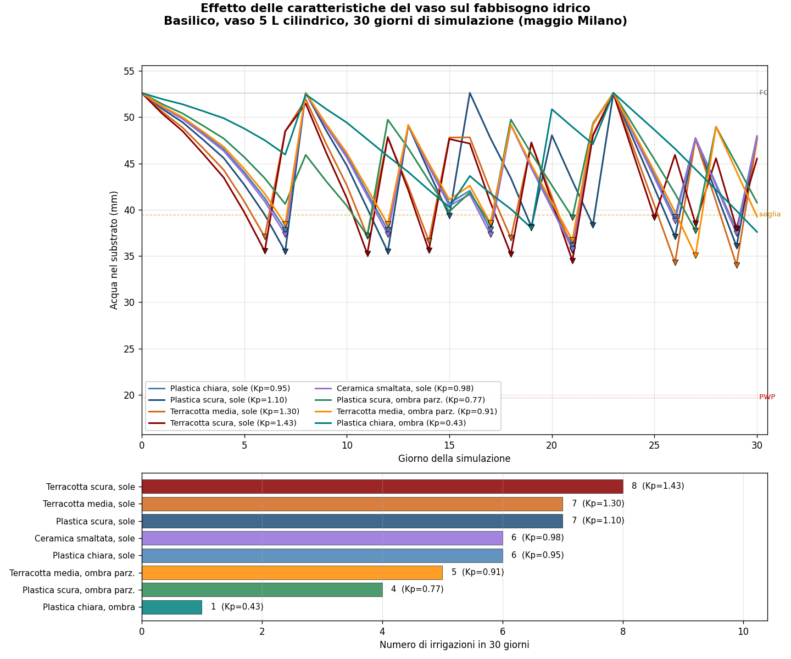
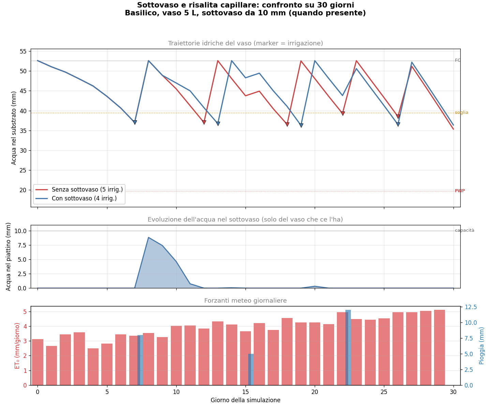
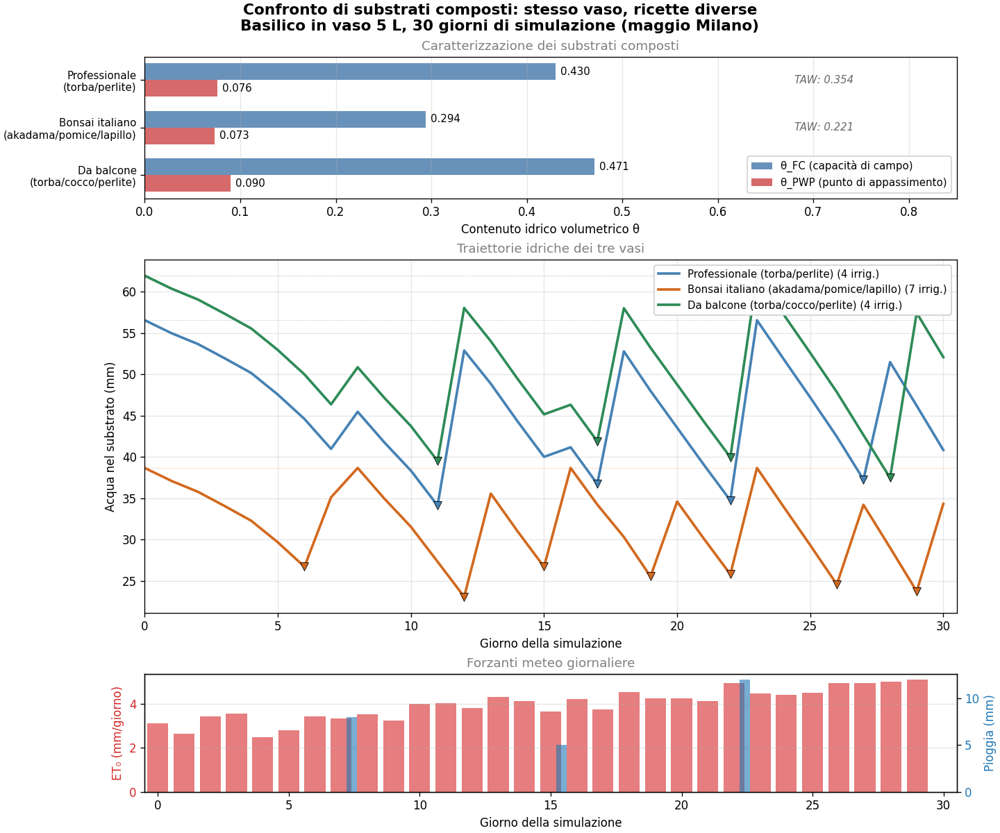
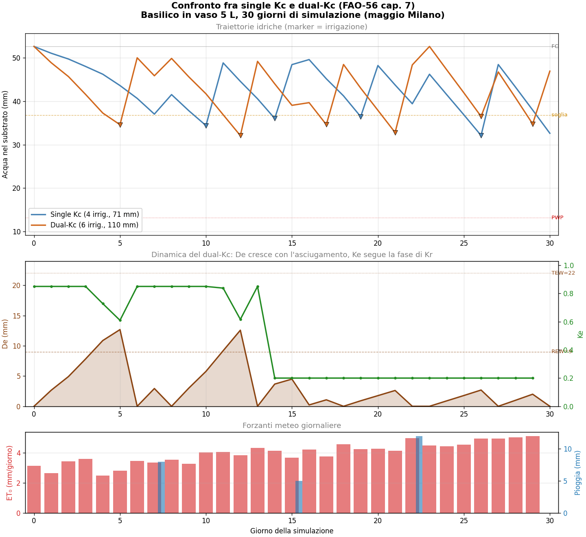
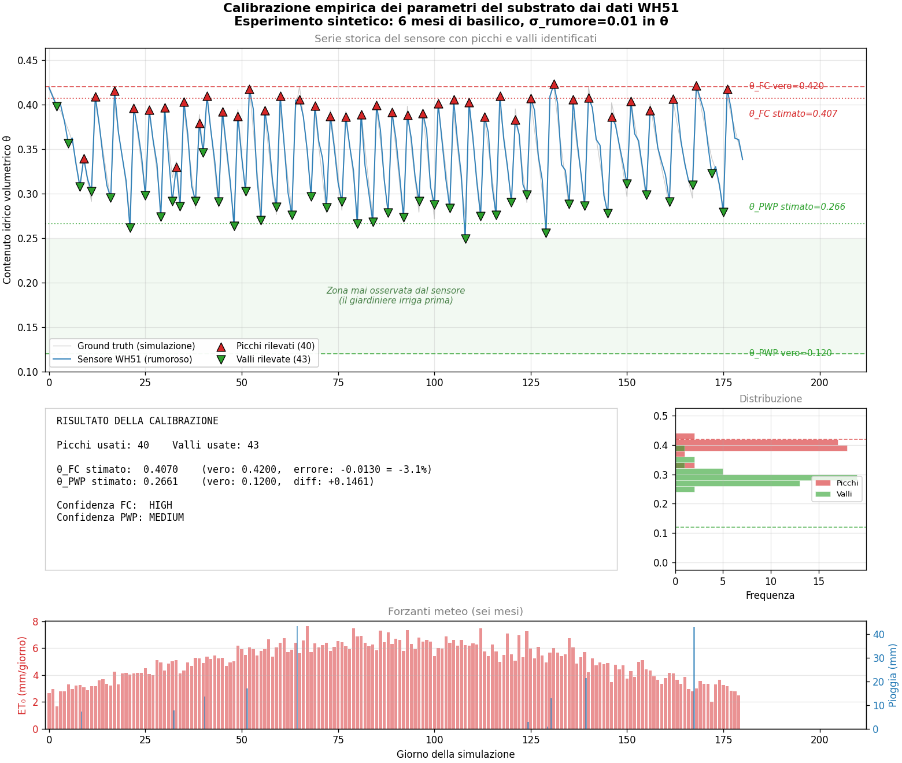
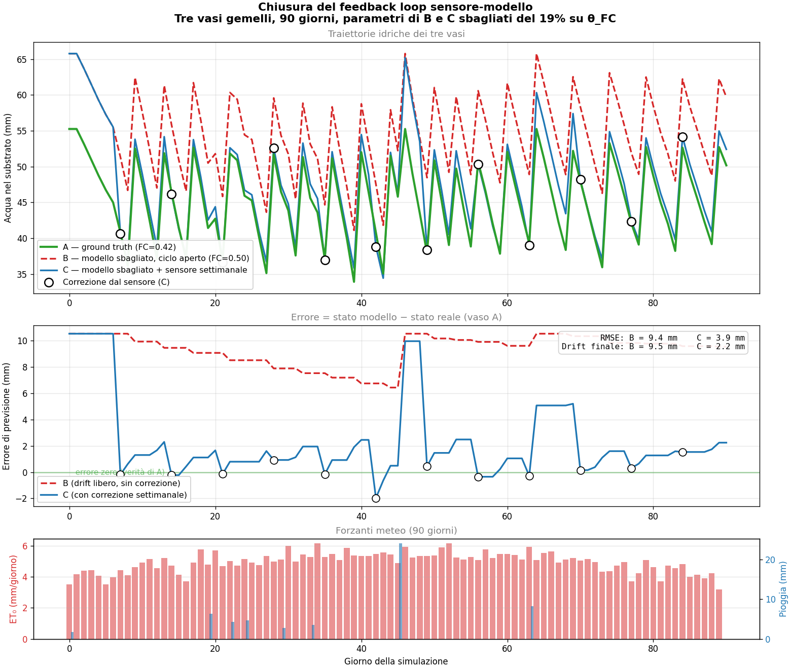

__fitosim__

*Sintesi della fascia 1 della roadmap*

Dal modello FAO-56 base alla chiusura del feedback loop sensore-modello

*Sei tappe di estensione del modello agronomico: caratterizzazione fisica del vaso, sottovaso con risalita capillare, fabbrica di mix dai materiali base, dual-Kc di FAO-56 capitolo 7, calibrazione empirica dei parametri dai sensori, e chiusura del feedback loop sensore-modello.*

Aprile 2026

Andrea — autore e curatore

# __Il punto di partenza e dove siamo arrivati__

fitosim è una libreria Python che modella il bilancio idrico delle piante coltivate in vaso, basata sulle equazioni del manuale FAO-56 "Crop Evapotranspiration" — il riferimento agronomico standard per la stima dell'evapotraspirazione delle colture. Il dominio di applicazione è specifico e deliberatamente ristretto: vasi domestici da balcone o terrazzo, su scale temporali giornaliere, per piante singolarmente identificabili. Non è un sostituto dei modelli idrologici di pieno campo (HYDRUS, RZWQM) né dei modelli fenologici complessi delle agronomie commerciali. È invece uno strumento pensato per il giardiniere domestico curioso che vuole capire cosa succede ai suoi vasi e ricevere consigli di irrigazione personalizzati basati su fisica solida.

Il punto di partenza era un'implementazione pulita ma essenziale di FAO-56 capitolo 6: il modello "single Kc" tradizionale, che riduce l'evapotraspirazione della coltura a un singolo coefficiente moltiplicativo applicato all'evapotraspirazione di riferimento. Questa base copriva i fondamentali — bilancio idrico giornaliero, coefficiente di stress idrico, fenologia tripartita — ma lasciava fuori molti aspetti che il giardiniere reale incontra ogni giorno: il vaso di terracotta che asciuga più del vaso di plastica, il sottovaso che restituisce acqua per capillarità, il mix di torba e perlite del proprio sacco specifico, i giorni post-irrigazione in cui il vaso perde acqua più velocemente del previsto, il sensore di umidità che misura la verità ma non era integrato col modello.

La fascia 1 della roadmap è stata progettata per affrontare sistematicamente queste lacune in sei tappe di estensione, ognuna con un obiettivo chiaro e una lezione didattica da consegnare al lettore. Le tappe non sono indipendenti: ognuna si appoggia su quelle precedenti e ne estende le possibilità senza modificarle. È una "torre" di concetti dove i piani superiori beneficiano della solidità di quelli inferiori, e dove la robustezza del progetto si misura nella backward compatibility totale — i 423 test della suite attuale includono tutti i test scritti dall'inizio del progetto, mai uno è stato modificato per accomodare una nuova estensione.

Questo documento è il racconto pedagogico di quel percorso. Per ognuna delle sei tappe descrive il problema fisico o pratico affrontato, la scelta di design adottata, il risultato visivo del demo dimostrativo associato, e la lezione operativa che il giardiniere può portarsi a casa. L'obiettivo non è solo documentare cosa fitosim sa fare, ma dare al lettore un'intuizione fisica del perché ognuna di queste estensioni paga il prezzo della complessità aggiunta. Alla fine del documento si trovano una sintesi dei principi di design emersi durante il percorso e un'indicazione delle direzioni future possibili per la fascia 2.

# __Tappa 1 — La caratterizzazione fisica del vaso__

## __Il problema: vasi diversi, stesso modello__

Il modello FAO-56 base trattava il vaso come un contenitore neutro: una semplice geometria con una profondità di substrato e una superficie evaporante calcolata dal diametro. Ma due vasi di identica geometria possono comportarsi in modi sorprendentemente diversi. Un vaso di terracotta scura al pieno sole asciuga molto più rapidamente di un vaso di plastica chiara in ombra parziale, pur ospitando la stessa pianta nello stesso substrato. La ragione è fisica: la terracotta è porosa e perde acqua per evaporazione laterale attraverso le pareti, il colore scuro assorbe più radiazione solare e riscalda il substrato, l'esposizione piena al sole aumenta il carico radiativo complessivo. Questi tre effetti si combinano moltiplicativamente, e il loro impatto sull'irrigazione reale di un vaso domestico può facilmente superare il 50%.

## __La soluzione: il coefficiente di vaso Kp__

L'estensione introduce il coefficiente di vaso Kp come fattore moltiplicativo dell'evapotraspirazione. Kp è il prodotto di tre sotto-fattori indipendenti, ognuno tabellato dalla letteratura agronomica vivaistica: un fattore di materiale (plastica, ceramica smaltata, terracotta, legno, metallo), un fattore di colore (chiaro, medio, scuro), e un fattore di esposizione (pieno sole, ombra parziale, ombra). I valori di default — plastica, colore medio, pieno sole — producono Kp = 1.00, mantenendo backward compatibility con il modello di base. Allontanandosi dai default, Kp può variare tra 0.70 (vaso di plastica chiara in ombra parziale) e 1.43 (terracotta scura al pieno sole), un range del doppio.

In aggiunta al coefficiente Kp, la tappa ha esteso \`Pot\` con il supporto a quattro forme geometriche distinte (cilindrico, tronco di cono, rettangolare, ovale) ognuna con la propria formula di superficie evaporante, e con un campo \`active\_depth\_fraction\` che permette di modellare la frazione attiva del substrato escludendo lo strato drenante in fondo al vaso. Tutti questi parametri sono opzionali con default neutri, mantenendo invariata l'interfaccia pre-esistente.

## __Il risultato__

Il demo dimostrativo confronta otto varianti di vaso identico per specie (basilico), substrato (torba commerciale) e geometria, ma con caratteristiche fisiche diverse, simulati su 30 giorni di meteo milanese di maggio. La variante più "calma" — plastica chiara in ombra parziale — richiede una sola irrigazione nel periodo. La variante più "estrema" — terracotta scura al pieno sole con frazione attiva ridotta — ne richiede otto. Una differenza dell'786%, ottenuta semplicemente cambiando le caratteristiche del contenitore. Per il giardiniere, questo è il segnale che la scelta del vaso non è un dettaglio estetico ma una decisione operativa con conseguenze quantificabili sul carico di cura settimanale.

*Otto varianti dello stesso vaso, con consumo idrico che varia di un fattore otto al cambiare di materiale, colore ed esposizione.*

## __La lezione__

Il vaso non è un attore passivo del bilancio idrico. È un componente attivo che modula tutti gli altri effetti, e ignorarlo significa sbagliare le previsioni di un fattore considerevole. La buona notizia è che i tre fattori principali — materiale, colore, esposizione — sono noti al giardiniere senza misurazioni speciali: guarda il vaso e li riconosci. Il prezzo della precisione è bassissimo, il guadagno è alto, e il modello li ha incorporati come moltiplicatori semplici che si compongono in modo trasparente.

# __Tappa 2 — Il sottovaso e la risalita capillare__

## __Il problema: dove va l'acqua di troppo?__

Quando un giardiniere irriga un vaso "fino a vedere l'acqua uscire dal fondo", quella che osserva è il segnale visivo che il substrato ha raggiunto la capacità di campo e l'eccesso sta drenando. Quel drenaggio finisce nel sottovaso, e da lì comincia una storia che il modello base ignorava completamente. Nei giorni successivi il sottovaso resta lì, parzialmente pieno, e accadono due cose simultanee. Da una parte l'acqua nel sottovaso evapora sulla superficie esposta all'aria, perdendola nell'atmosfera. Dall'altra parte, finché il substrato del vaso è meno bagnato del sottovaso, le forze capillari del substrato risucchiano acqua dal basso verso l'alto, recuperando una parte di quello che era stato drenato.

Il bilancio netto di queste due perdite e recuperi non è banale, ed è sensibile a dettagli operativi importanti. Se il sottovaso è grande rispetto al vaso, può immagazzinare acqua sufficiente da sostenere il vaso per uno o due giorni in più tra un'irrigazione e l'altra. Se è piccolo, l'effetto è quasi trascurabile. Se il giardiniere ha l'abitudine di vuotare il sottovaso poco dopo l'irrigazione (per evitare ristagni che possono far marcire le radici), l'effetto si azzera. Il modello deve catturare questa varietà di comportamenti senza prescriverne uno specifico.

## __La soluzione: secondo serbatoio idrico accoppiato__

L'estensione modella il sottovaso come un secondo serbatoio idrico con la sua propria capacità massima e il suo proprio stato idrico, accoppiato al vaso principale tramite due flussi giornalieri. Il flusso di evaporazione dal sottovaso è proporzionale all'ET₀ del giorno con un coefficiente piattino tipico di 0.4. Il flusso di risalita capillare è proporzionale al deficit di acqua del vaso rispetto alla sua capacità di campo, con un tasso di trasferimento che dipende dal substrato (default 0.4 per substrati standard). I parametri del sottovaso sono opzionali su \`Pot\`: quando il vaso non ne ha uno specificato, il modello si comporta esattamente come prima. Quando ce l'ha, l'orchestrazione dei due flussi avviene automaticamente all'interno di \`apply\_balance\_step\`.

## __Il risultato e una lezione metodologica__

Il demo confronta due vasi gemelli di basilico identici in tutto tranne che per la presenza del sottovaso. Su 30 giorni di simulazione, il vaso senza sottovaso richiede sette irrigazioni; quello con sottovaso ne richiede sei, con un risparmio idrico complessivo del 14.5%. Una sola irrigazione in meno al mese può sembrare poco, ma diventa significativa per chi cura una decina di vasi: significa quasi un giorno e mezzo di tempo libero in più durante la stagione di crescita.

Quel 14.5%, per altro, è emerso da una correzione metodologica importante. La prima versione del demo aveva impostato il parametro \`IRRIGATION\_EXCESS = 1.0\` (irrigazione esattamente alla capacità di campo, niente eccesso) e produceva un risparmio di solo 1.3%. Quel valore era corretto matematicamente ma irrealistico fenomenologicamente: nessun giardiniere irriga "esattamente alla capacità di campo" — tutti irrigano "fino a vedere l'acqua dal fondo", che corrisponde a un eccesso del 20-30% perché serve un po' di acqua extra perché si veda il drenaggio. Correggendo a \`IRRIGATION\_EXCESS = 1.25\`, la simulazione ha cominciato a comportarsi come la realtà, e il sottovaso ha potuto fare il suo lavoro di "salvadanaio" raccogliendo l'eccesso e restituendolo nei giorni successivi. Lezione: i parametri "didattici" delle simulazioni devono rispecchiare il gesto reale del giardiniere, non l'astrazione del modello matematico.

*Due vasi gemelli con e senza sottovaso. La curva con sottovaso mostra recuperi capillari visibili nei giorni post-irrigazione e una irrigazione in meno nel periodo.*

# __Tappa 3 — La fabbrica di mix dai materiali base__

## __Il problema: il catalogo limitato__

Il modello base offriva un catalogo di sei substrati pronti — torbo-perlite universale, mix per cactacee, cocco puro, e qualche altro — ciascuno con valori di θ\_FC e θ\_PWP fissi presi dalla letteratura. Questa scelta funzionava per il giardiniere casual che compra il sacco al supermercato, ma lasciava fuori una fetta importante di pubblico: chi prepara i propri mix personalizzati partendo dai materiali base. Bonsaisti, coltivatori di succulente, orticoltori da balcone con esigenze specifiche — tutti loro parlano la lingua delle ricette ("metto tre quarti di torba bionda e un quarto di perlite") più che quella dei substrati preconfezionati. Il modello doveva imparare quella lingua.

## __La soluzione: nove materiali base e media pesata__

L'estensione introduce una fabbrica per costruire substrati personalizzati a partire da una ricetta di materiali base. Il catalogo dei materiali base contiene nove ingredienti coperti dalla letteratura agronomica vivaistica e bonsaistica: torba bionda e torba bruna, perlite, vermiculite, fibra di cocco, pomice, sabbia, akadama e lapillo. Ognuno ha i suoi parametri idraulici θ\_FC e θ\_PWP derivati da medie di range pubblicati, accompagnati da una nota descrittiva che riporta provenienza e granulometria tipica. La funzione \`compose\_substrate(components, name)\` riceve una lista di ricette del tipo \`MixComponent(materiale, frazione)\` e calcola i parametri risultanti come media pesata sui volumi delle frazioni.

Il modello matematico è il più semplice tra quelli sensati e introduce un'approssimazione del 5-10% rispetto a misure dirette in laboratorio. La ragione è che la media pesata trascura due effetti del secondo ordine: il packing tra particelle di granulometria diversa (le particelle fini si infilano negli interstizi delle grosse modificando la porosità totale) e la non-linearità della curva di ritenzione idrica del substrato composto. Queste approssimazioni sono accettabili per il dominio del giardinaggio domestico, e quando servirà più precisione la strada giusta sarà la calibrazione empirica dai sensori (di cui parleremo nella tappa 5), non la raffinazione del modello teorico.

## __La lezione: il TAW è la metrica decisiva__

Il demo dimostrativo confronta tre ricette di substrato applicate allo stesso vaso di basilico: un mix professionale 70/30 torba-perlite, un mix bonsai italiano 40/30/30 di akadama-pomice-lapillo, e un mix da balcone 50/30/20 di torba-cocco-perlite. I numeri risultanti raccontano una storia che a prima vista può sembrare paradossale: il mix bonsai richiede sette irrigazioni in 30 giorni, mentre i mix più ritentivi (professionale e da balcone) ne richiedono solo quattro. Quasi il doppio. Perché?

La risposta sta in una metrica chiamata Total Available Water (TAW), che è semplicemente la differenza θ\_FC − θ\_PWP, ovvero l'acqua effettivamente accessibile alla pianta tra il pieno e l'asciutto. Il mix bonsai ha TAW di 0.221, mentre il mix da balcone ha TAW di 0.381 — il 72% in più. A parità di volume del vaso, il mix bonsai contiene molta meno acqua disponibile per la pianta tra un'irrigazione e l'altra, e si esaurisce più rapidamente. Il modello fitosim ha catturato perfettamente questo comportamento. La lezione operativa è importante: non esiste un substrato "buono" o "cattivo" in assoluto. Esistono substrati adatti a piante che tollerano (o preferiscono) cicli idrici frequenti e brevi (i bonsai), e substrati adatti a piante che vogliono stabilità idrica con cicli lunghi (le piante da balcone). Mettere il substrato sbagliato sotto la pianta sbagliata costringe il giardiniere a un carico di cura sproporzionato.

*Tre ricette di substrato confrontate sullo stesso basilico. Il mix bonsai con TAW basso richiede quasi il doppio delle irrigazioni del mix da balcone con TAW alto.*

# __Tappa 4 — Il dual-Kc di FAO-56 capitolo 7__

## __Il problema: la dinamica nascosta__

Il modello single Kc usato fino a questo punto ha una limitazione concettuale che ogni giardiniere ha osservato senza nominarla. Nelle 24-48 ore successive a un'irrigazione abbondante, il vaso perde acqua più velocemente del suo ritmo "stazionario": il substrato superficiale è bagnato e l'acqua evapora direttamente dalla superficie, in aggiunta a quella che la pianta consuma traspirando. Poi la superficie si asciuga, l'evaporazione superficiale crolla, e da quel momento il consumo torna a essere dominato dalla sola traspirazione fogliare. Il single Kc media questi due regimi in un singolo numero costante, sottostimando sistematicamente il consumo nei giorni post-irrigazione del 15-25%.

## __La soluzione: separare traspirazione ed evaporazione superficiale__

Il modello dual-Kc, descritto nel capitolo 7 di FAO-56, separa esplicitamente le due componenti dell'evapotraspirazione. La formula totale diventa ETc = (Kcb \+ Ke) × ET₀, dove Kcb (basal crop coefficient) rappresenta solo la traspirazione fogliare ed è quasi costante per stadio fenologico, mentre Ke (soil evaporation coefficient) rappresenta solo l'evaporazione superficiale ed è dinamico nel tempo. Ke segue un modello a due fasi: nella fase 1 ("energy-limited") il substrato superficiale ha riserva di acqua facilmente disponibile e Ke è massimo; nella fase 2 ("falling-rate") il substrato si è asciugato oltre una soglia REW e Ke decresce linearmente verso zero, raggiungendo zero quando si arriva alla soglia TEW di evaporabile totale. La transizione tra le due fasi è governata da una variabile di stato chiamata De (cumulative depletion superficiale) che cresce con l'evaporazione e si resetta a ogni nuovo evento di bagnatura.

L'attivazione del dual-Kc è automatica e graduale: avviene quando la specie ha i Kcb valorizzati e il substrato ha REW e TEW. Quando mancano questi parametri, il modello ricade sul single Kc tradizionale senza interventi del chiamante. È lo stesso pattern di opt-in con default neutro che abbiamo usato per le altre estensioni, e mantiene la backward compatibility totale.

## __Il risultato e una lezione di rigore numerico__

Il demo confronta due basilici gemelli simulati per 30 giorni, uno con motore single Kc e l'altro con dual-Kc. Il dual-Kc consuma il 54.4% di acqua in più del single Kc complessivamente, richiedendo 6 irrigazioni invece di 4, ma la differenza è concentrata quasi interamente nei primi 14 giorni. In stadio iniziale (basilico piccolo, chioma poco sviluppata) Ke vale fino a 0.85 e contribuisce pesantemente al consumo. Quando la pianta entra in stadio mid-season, la chioma intercetta gran parte della radiazione e Ke crolla a 0.20 — da quel momento i due modelli diventano quasi indistinguibili. Il dual-Kc paga davvero solo nelle prime settimane dopo il trapianto, ed è esattamente lì che il giardiniere fa più fatica a stimare i consumi correttamente.

Durante lo sviluppo della tappa è emerso un bug istruttivo che vale la pena raccontare per onestà metodologica. La prima implementazione ha semplificato la formula di Kcmax (il limite energetico del modello) come Kcb \+ 0.05, scambiando il "pavimento" dell'equazione 72 di FAO-56 con il valore principale. L'effetto era devastante: Ke veniva schiacciato a un valore irrilevante e il dual-Kc finiva per consumare meno del single Kc, un risultato fisicamente impossibile. Il bug è stato visibile solo perché il demo confrontava direttamente i due modelli — senza il confronto, i numeri assoluti sembravano ragionevoli e l'errore concettuale sarebbe passato inosservato. La lezione è che i modelli fisici vanno sempre validati contro intuizioni qualitative attese, perché solo questi controlli grossolani catturano errori di interpretazione che i singoli numeri possono nascondere. La correzione, Kcmax = max(climate\_baseline=1.20, Kcb \+ 0.05), ha riportato il modello al comportamento atteso e fa parte del codice attuale.

*Single Kc vs dual-Kc sullo stesso basilico. Il dual-Kc cattura il consumo aggiuntivo nei giorni post-irrigazione, soprattutto nei primi 14 giorni di stadio iniziale.*

# __Tappa 5 — La calibrazione empirica dai sensori__

## __Il problema: dalla letteratura al vaso specifico__

I parametri del catalogo dei substrati provengono dalla letteratura agronomica e sono valori medi calcolati su molti vasi diversi. Il vaso specifico che il giardiniere ha sul balcone ha invece la sua storia, la sua compattazione del fondo, il suo perched water table (la zona satura sopra il foro di drenaggio), e in generale parametri "effettivi" che possono differire del 10-30% dai valori tabellati. Quando un sensore di umidità è disponibile (come il WH51 della stazione Ecowitt), questi parametri si possono ricavare direttamente dai dati osservati, senza dover stimare. È il momento in cui fitosim comincia a "sentire" il vaso reale invece di descriverlo da fuori.

## __La soluzione: peak/valley detection sulla serie del sensore__

L'estensione introduce un nuovo modulo \`science/calibration.py\` con cinque funzioni principali. Le due funzioni di base, \`find\_peaks\` e \`find\_valleys\`, identificano i massimi e i minimi locali in una serie temporale di letture θ del sensore, applicando filtri di robustezza standard (distanza minima tra estremi, prominenza minima sopra il rumore). Le due funzioni di stima, \`estimate\_theta\_fc\` e \`estimate\_theta\_pwp\`, applicano statistica robusta basata su percentili — il 75° dei picchi per FC, il 10° delle valli per PWP — per evitare che singoli outlier perturbino i risultati. La funzione orchestratore \`calibrate\_substrate\` produce un \`CalibrationResult\` strutturato che include numerosità, livelli di confidenza differenziati (high/medium/low) e note esplicative.

## __La lezione: l'asimmetria epistemologica FC-PWP__

Qui c'è una sottigliezza che è il cuore didattico della tappa. La stima di θ\_FC è facile: ogni irrigazione abbondante crea un picco nella serie del sensore che, dopo il drenaggio, si attesta intorno alla capacità di campo effettiva del vaso. Con sei mesi di dati abbiamo dozzine di picchi indipendenti che convergono su un valore stabile e robusto. La stima di θ\_PWP è invece intrinsecamente un problema diverso. Per definizione θ\_PWP è il livello di appassimento della pianta, ma il giardiniere che cura il vaso irriga prima che la pianta soffra. Il sensore non vede mai il vero appassimento: vede solo "il punto più asciutto a cui il giardiniere ha lasciato arrivare il vaso", che è tipicamente molto sopra al PWP reale. La stima ricavata dalle valli è quindi un limite superiore, non un valore preciso.

Il modulo comunica questa asimmetria onestamente, attraverso il campo \`confidence\_pwp\` che è capato a "medium" anche con tantissimi dati, e attraverso una nota esplicativa nei risultati che avverte esplicitamente: "La stima di θ\_PWP è un limite SUPERIORE: il vero PWP potrebbe essere più basso." Onorare questa asimmetria è più prezioso che fingere una precisione inesistente. Per il giardiniere che usa fitosim, questo significa: per FC, fidarsi della calibrazione del proprio sensore; per PWP, usare il valore di letteratura del substrato di riferimento e considerare la stima da sensore come sanity check.

L'esperimento sintetico del demo dimostra entrambi gli aspetti. Generando una serie sintetica con FC=0.42 e PWP=0.12 e aggiungendo rumore realistico del sensore, la calibrazione recupera FC=0.4070 (errore -3.1%, confidenza high) ma stima PWP=0.2661 (limite superiore: vero PWP=0.12 nella zona mai osservata). Il grafico evidenzia visivamente la "zona invisibile al sensore" tra ~0.27 e 0.12, dove il giardiniere virtuale non lascia mai scendere il vaso. È la traduzione visiva del concetto di limite superiore.

*Calibrazione sintetica: FC recuperato a meno del 3% di errore, PWP stimato come limite superiore (la zona verde chiara è quella che il sensore non vede mai perché il giardiniere irriga prima).*

# __Tappa 6 — La chiusura del feedback loop sensore-modello__

## __Il problema: il drift accumulato__

Tutto il modello fitosim, fino alla tappa precedente, ha funzionato come un sistema a ciclo aperto: prende parametri e forzanti meteo, produce previsioni dello stato del vaso, e va avanti senza mai verificare se quelle previsioni corrispondono alla realtà. Anche con la calibrazione empirica della tappa 5 che migliora i parametri, restano sempre piccole discrepanze che accumulano nel tempo: il meteo previsto non è quello osservato, il giardiniere ha innaffiato un po' più o un po' meno della dose calcolata, una giornata di vento forte ha asciugato il vaso più del previsto. Il drift accumula su orizzonti lunghi, soprattutto quando i parametri sono leggermente sbagliati, e senza informazione di feedback il modello non ha modo di accorgersene.

## __La soluzione: il metodo update\_from\_sensor__

L'estensione finale aggiunge a \`Pot\` due componenti compatte ma operativamente molto trasformative. La dataclass \`SensorUpdateResult\` raccoglie in modo strutturato tutti i dati prodotti durante un aggiornamento: previsione e osservazione (in θ e in mm), discrepanza con segno, errore relativo, e due property derivate utili (\`absolute\_error\_mm\` e \`is\_significant\`). Il metodo \`update\_from\_sensor(theta\_observed)\` orchestra il confronto, aggiorna \`state\_mm\` per allinearsi alla lettura del sensore, e restituisce il report. È meno di cento righe di codice in totale, ma cambia qualitativamente cosa il sistema può fare: da modello previsionale a ciclo aperto a modello con feedback continuo dalla realtà osservata.

La convenzione del segno della discrepanza è esplicita e documentata. Un valore positivo significa che il sensore vede più acqua del previsto, suggerendo che il modello ha sovrastimato il consumo o che è successo un evento di bagnatura non registrato. Un valore negativo significa l'opposto. Una serie storica di queste discrepanze è il segnale principale per detectare la necessità di ricalibrare i parametri: discrepanze sistematicamente di un certo segno indicano un bias del modello che la calibrazione empirica può correggere alla radice.

## __Il risultato: 58.9% di riduzione del drift con stessi parametri__

Il demo finale è la dimostrazione operativa più diretta del valore di chiudere il feedback loop. Tre vasi gemelli simulati per 90 giorni: A ha parametri corretti del substrato e produce la "realtà" che gli altri vasi cercano di seguire; B ha parametri leggermente errati (θ\_FC sovrastimato del 19%) e funziona a ciclo aperto; C ha gli stessi parametri sbagliati di B ma riceve un aggiornamento settimanale dal sensore di A. Il vaso B accumula nei 90 giorni un drift finale di 9.5 mm rispetto alla realtà, con RMSE di 9.4 mm. Il vaso C, con gli stessi identici parametri sbagliati, limita il drift finale a 2.2 mm e l'RMSE a 3.9 mm — una riduzione del 58.9% solo grazie al feedback, senza modificare i parametri.

La lezione operativa è chiara: buone osservazioni battono buoni parametri, soprattutto su orizzonti lunghi dove il drift accumula. Per "Il Mio Giardino", il dashboard di gestione del giardino domestico per cui fitosim è stato concepito come motore agronomico, questo significa che la lettura giornaliera del sensore WH51 — già disponibile gratuitamente — può essere usata direttamente per tenere il modello allineato alla realtà. Non serve ricalibrare i parametri ogni mese; basta lasciare che il feedback loop faccia il suo lavoro nel quotidiano, e usare le discrepanze accumulate come segnale per quando una vera ricalibrazione diventa opportuna.

*Tre vasi gemelli con parametri identici per B e C. Senza feedback (B), il drift accumula a 9.5 mm. Con feedback settimanale (C), il drift resta sotto 2.5 mm pur con gli stessi parametri sbagliati.*

# __Sintesi: i principi di design emersi__

Guardando l'insieme delle sei tappe a percorso completato, emergono alcuni principi di design che hanno fatto la differenza tra un sistema che cresce in modo armonioso e uno che si frammenterebbe sotto il peso delle estensioni. Vale la pena metterli a fuoco esplicitamente perché sono trasferibili ad altri progetti scientifici e ingegneristici, e perché illustrano cosa distingue il software ben progettato da quello solo funzionante.

## __Backward compatibility totale come bussola__

Ogni tappa ha aggiunto capacità nuove al sistema senza modificare una singola riga di codice esistente che fosse coperta da test. I 230 test della suite iniziale sono ancora tutti presenti e verdi nei 423 test attuali, e nessuno di essi è stato adattato a una nuova estensione. Questo risultato non è frutto del caso. È la conseguenza di una scelta deliberata: ogni nuova capacità è stata aggiunta come opt-in con default neutro, in modo che chi non ne ha bisogno non se ne accorga e chi ne ha bisogno la attivi esplicitamente. Il vaso senza sottovaso resta un vaso senza sottovaso; quello senza Kcb resta in modalità single Kc; quello senza sensore resta a ciclo aperto. La somma di queste scelte piccole ha prodotto un sistema dove sei estensioni sostanziose coesistono senza interferenze.

## __Layer architecture e separazione di responsabilità__

Il progetto distingue rigorosamente tre livelli di astrazione: il layer \`science\` con funzioni pure (input → output, niente stato), il layer \`domain\` con classi che orchestrano lo stato e le interazioni, e il layer \`io\` per fetcher e parser delle fonti dati esterne. Ogni nuova tappa scientifica ha aggiunto un modulo nel layer \`science\` che è stato testabile in isolamento prima di essere integrato in \`Pot\`. Questa separazione ha pagato due volte: una nei test, perché le funzioni pure sono facili da coprire con esperimenti sintetici; una nel debug, perché quando qualcosa non funziona si può isolare l'errore al livello giusto senza dover navigare l'intero sistema. Il bug del Kcmax sbagliato della tappa 4 è stato individuato esattamente perché si poteva confrontare il comportamento del modulo \`dual\_kc\` con quello del \`pot.py\` e localizzare la responsabilità.

## __Validazione progressiva con esperimenti sintetici__

Le tappe più ambiziose — calibrazione empirica e chiusura del feedback loop — sono state validate con la tecnica dell'esperimento sintetico: costruire dati per cui conosciamo la risposta giusta, far girare il sistema senza dirgli la verità, verificare che la recuperi entro tolleranze ragionevoli. Questo approccio è potente perché trasforma una validazione "qualitativa" in una "quantitativa" e produce automaticamente dei test di regressione che vivono nella suite. Quando in futuro qualcuno modificherà la logica di \`find\_peaks\` o di \`update\_from\_sensor\`, l'esperimento sintetico sarà lì a verificare che il recupero ground truth resti corretto. È un investimento di codice che ripaga molte volte nel tempo.

## __Onestà nei limiti del modello__

L'asimmetria FC-PWP della calibrazione, l'isolamento di \`de\_mm\` dall'aggiornamento del sensore, l'approssimazione del 5-10% nella fabbrica di mix — tutte queste sono limitazioni del modello che avremmo potuto cercare di nascondere o di aggirare con complicazioni aggiuntive. Invece le abbiamo documentate esplicitamente nelle docstring, comunicate al chiamante attraverso campi di confidenza, e accettate come parte del costo legittimo della semplificazione. Onorare queste limitazioni è più prezioso che fingere una precisione inesistente. Per il giardiniere che usa il sistema, una stima corretta accompagnata da una nota di confidenza vale più di una stima sbagliata presentata con sicurezza.

## __I numeri del progetto a chiusura della fascia 1__

Per chiudere il bilancio quantitativo: la libreria fitosim attuale è composta da undici moduli sorgente più dodici file di test, per un totale di circa 5200 righe di test e 423 test verdi che eseguono in poco più di un secondo. Sei demo dimostrativi coprono le sei tappe della fascia 1, ognuno con un grafico didattico che illustra la funzionalità su un caso realistico (gli stessi sei grafici incorporati in questo documento). La dipendenza esterna principale è \`matplotlib\`, usato solo nei demo; il core della libreria continua a girare con la sola standard library di Python, mantenendo la portabilità necessaria per il deployment su Termux o Raspberry Pi 5 senza ulteriori installazioni.

# __Direzioni future: cosa manca e cosa è già abbastanza__

La fascia 1 è chiusa, ma il progetto ha ancora margini di crescita lungo direzioni diverse. La roadmap è strutturata in tre fasce di priorità decrescente, e ognuna serve un'esigenza diversa.

## __Fascia 2: estensioni candidate ad alto valore__

Le estensioni della fascia 2 sono quelle che migliorerebbero visibilmente il sistema ma il cui valore va pesato caso per caso. L'integrazione di Penman-Monteith completo per il calcolo di ET₀ (al posto dell'attuale Hargreaves-Samani) richiederebbe l'importazione di umidità relativa e velocità del vento dalla stazione meteo, ma porterebbe il margine di errore su ET₀ dal 5-10% attuale al 2-3%. L'integrazione di sensori di temperatura e umidità per piante indoor (WN31 CH1) permetterebbe di calcolare ET₀ con il microclima effettivo della casa invece di quello esterno, eliminando l'errore sistematico che le piante in appartamento subiscono dal modello attuale. La persistenza degli stati su database renderebbe fitosim utilizzabile come servizio di lunga durata invece che come libreria stateless. Tutte queste estensioni sono fattibili e utili, ma nessuna è bloccante.

## __L'integrazione operativa con Il Mio Giardino__

Una direzione complementare alla fascia 2 è l'integrazione operativa di fitosim con il dashboard "Il Mio Giardino", il sistema di gestione del giardino domestico per cui fitosim è stato concepito come motore agronomico di backend. Concretamente questo significa scrivere un adapter che fa girare fitosim come servizio agganciato al database SQLite del dashboard, alimentato dalle letture orarie della stazione Ecowitt e dalla previsione meteo di Open-Meteo, che produce raccomandazioni di irrigazione visibili nell'interfaccia HTML/CSS/JS del dashboard. È più un progetto di sistema che un progetto di scienza, ed è la prima cosa che vedrebbe il giardiniere reale.

## __Un manuale narrativo per il giardiniere__

Una terza direzione, complementare alle altre due, è scrivere un manuale narrativo per il giardiniere finale, distinto sia dal documento tecnico generato da \`build\_report.js\` sia da questo documento di sintesi pedagogica. Sarebbe una guida più amichevole che parla dei concetti agronomici con esempi concreti — "il mio basilico sul balcone consuma più del mio rosmarino perché...", "se il sensore mi dice che il vaso è a 0.32, vuol dire che..." — senza pretendere che il lettore conosca FAO-56 o sappia leggere docstring Python. È una direzione di scrittura, non di codice, e metterebbe in primo piano l'utente finale del sistema.

## __Cosa è già abbastanza__

C'è una considerazione finale che voglio mettere in luce. fitosim, allo stato attuale, è già uno strumento operativamente capace di guidare le decisioni di irrigazione di un giardino domestico strumentato. Le sei tappe della fascia 1 hanno coperto le esigenze fisiche fondamentali (caratterizzazione del vaso, sottovaso, mix di substrato), il modello agronomico più completo disponibile per il dominio (dual-Kc), e la chiusura del cerchio sensore-modello che permette al sistema di apprendere dalla realtà osservata. Le estensioni della fascia 2 sono raffinamenti, non riempimenti di lacune. Per il giardiniere reale, il sistema attuale ha già tutto quello che serve per essere utile.

È una soglia psicologica importante da riconoscere nei progetti di questo tipo. La tentazione di continuare a estendere è forte e spesso giustificata, ma a un certo punto il valore marginale di ogni nuova estensione diminuisce mentre il costo di mantenimento cresce. fitosim ha raggiunto il suo punto di "abbastanza buono" e da qui in poi le estensioni vanno valutate con un occhio attento al rapporto costo-beneficio. Forse la cosa più valore-aggiunta che si può fare adesso non è scrivere altro codice, ma metterlo nelle mani di chi ne può effettivamente beneficiare — chiudendo l'integrazione con Il Mio Giardino e raccogliendo il feedback dell'uso reale per orientare gli sviluppi futuri.

